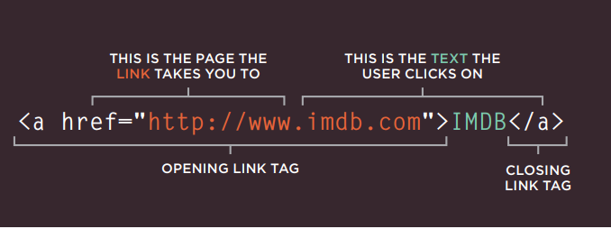

# HTML Links, JS Functions, and Intro to CSS Layout

## links
links are essential because we can use them to :
* link from one website to anohter website
* links from one page to another on the same website
* Links from one part of a web page to another part of the same page
*  Links that open in a new browser window
*  Links that start up you

\

if you want to link other parts of the same page, you can use

href="#top", where inside the qoutation after the # sign, you write the id of a specific tag you want to refer to. 
## layouts 

### controling the position of elements
important note: css treats  each HTML elemnt as if it is in its own box. this box will either be a block-level box or an inline box. it might be helpful to copare block-level to inline blok 
block-level:
1. they start on a new line and takes the whole space from left to right on the page. 

Inline: 
1. you can control how much space each box takes up by setting the width of the boxes (and sometimes the height, too)
2. examples of block-level elemnts are h1, p, ul, and li
2. to sparate boxes, you can use borders, margins, padding and background colours. 
3. examples of inline elements are: image, b, i
